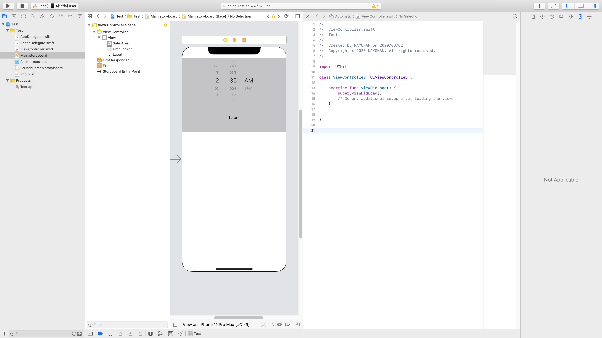

## ViewController

- View를 관리하는 Contorller로 ios앱의 각각의 화면을 구성
- 새로운 화면을 만들때마다 새로운 VeiwController생성

### 1. ViewController 구성

- 왼쪽 패널 ( command + 1)
  1. 프로젝트 파일 탐색기
  2. ?
  3. 프로젝트 계층구조
  4. 검색
  5. 빌드 횟수
  6. 테스트
  7. 디버그 > 디바이스 사용률
  8. 중단점
  9. 디버그 빌드 사용

- 오른쪽 패널 ( command + alt + 1)
  1. Identity and Type / On Demand Resource Tags / Localization / TargetMembership
  2. history
  3. help
  4. Custom Class / Identity / Document / Accessibility
  5. View property / Control / View
  6. size inspector
  7. Trigeered Segues / Outlet Collections / Sent Events
