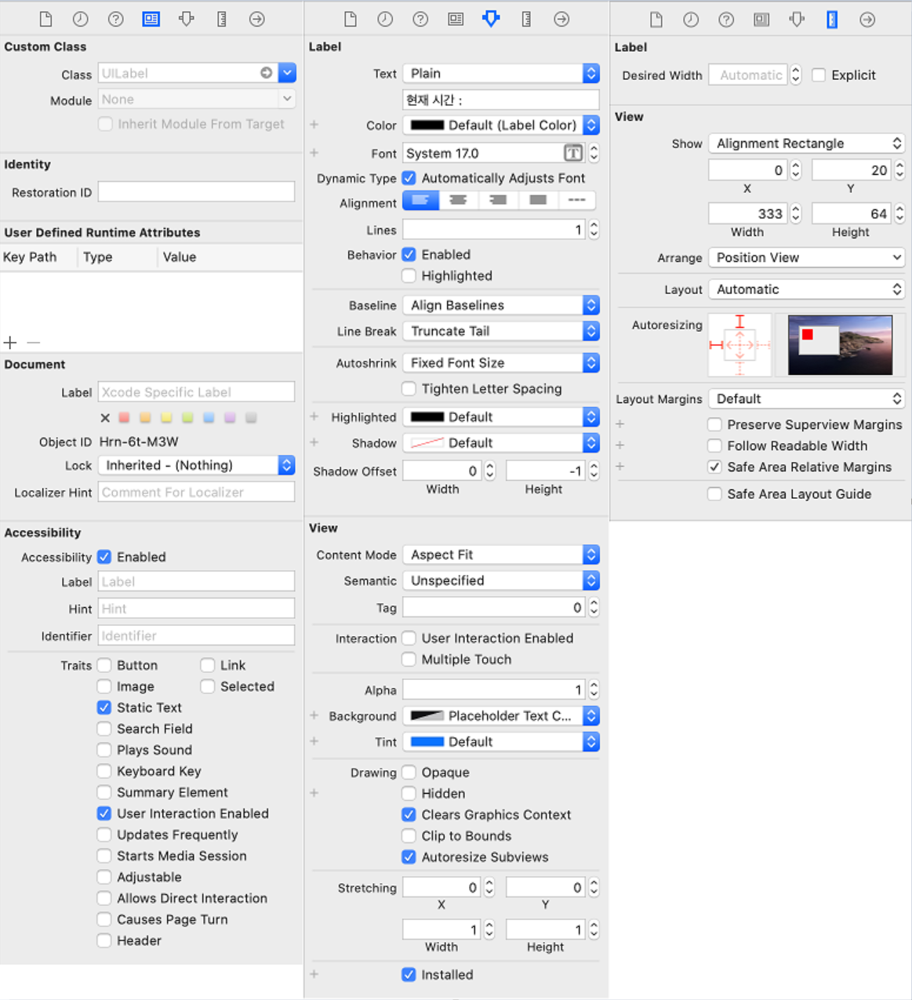

## Storyboard


### 1. Storyboard

스토리보드를 보면 기본적으로 다음과 같이 나타난다. 따라서 ViewController안에 여러가지 기능을 추가할수 있음


일단 command + shift + L을 누르면


다음과 같은 여러가지 Objects가 나타나는데 이를 드래그앤 드롭으로 Interface Builder에 넣음

넣어보면 다음과 같이 여러가지 설정을 할수 있는데, 레이블의 경우




### 2. Asistant View

contorl + command + alt + enter를 누르면 Asistant View가 뜨는데 여기에 코딩을 할 수 있음


다음과 같이 코드를 작성하는데 간단히 설명하면 

- 전역변수 var,  let 최상단에 표기

- **@IBOutlet**은 View에 있는 Object들을  변수로 생성

- **Selector**로 **@objc func** 함수를 선택 후 타이머,등에 사용

- **@IBAction func** : 객체의 관련된 동작 함수


### 3. Objects


#### 3.1. DatePicker


-  **날짜 값 받아오기** : DatePicker가 선택되었을때 값을 **DateFormmater**클래스를 이용하여 날짜형식을 지정하고, 형식에 맞게 선택된 값을 String형태로 lable에 나타냄

    ```swift
        @IBOutlet weak var lblPickerTime: UILabel!
    
    	//날짜선택하면 레이블에 날짜표시
        @IBAction func changeDatePicker(_ sender: UIDatePicker) {
            let datePickerView = sender
            let formatter = DateFormatter()
            formatter.dateFormat = "yyyy-MM-dd HH:mm EEE"
            lblPickerTime.text = "선택시간:" + formatter.string(from: datePickerView.date)
            alarmTime = formatter.string(from: datePickerView.date)
        }
    ```

- **날짜 표시(타이머)** : 타이머를 이용해 1초마다 날짜를 레이블에 표시함

  ```swift
  //타이머에서 작동 시킬 Selector객체 생성(함수 연결)
  let timeSelector: Selector = #selector(ViewController.updateTime)
//타이머에서 사용할 시간간격 TimeInterval변수
  var interval: TimeInterval = 1
  
  override func viewDidLoad() {
      super.viewDidLoad()
      //타이머 작동 : 1초마다 timeSelector를 작동
      Timer.scheduledTimer(timeInterval: TimeInterval(interval), target: self, selector: timeSelector, userInfo: nil, repeats: true)
  }
  
  //Selector에 연결되어 있는 함수 : 날짜를 레이블에 표시
  @objc func updateTime(){
      let date = NSDate()
      let formmater = DateFormmater()
      formmater.dateFormat = "yyyy-MM-dd HH:mm:ss"
      lblCurrentTime.text = "현재 시간" + formmater.string(from: date as Date)    
  }
  ```
  


#### 3.2. PickerView


- Delegate : 누군가 해야 할 일을 대신 해주는 역활. 사용자가 객체를 터치했을때 해야할일을 Delegate Method에 구현하고, 터치되면 Delegate호출되어 위임받은 일을 하게함

```

```


